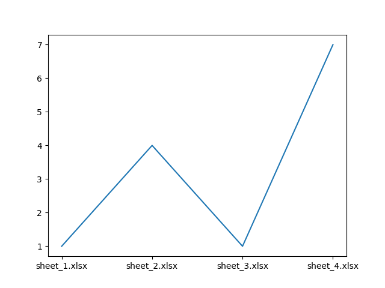

# pyGraph
This is a python script that graphs a singular cell across multiple excel files. This script can be run from the terminal, with information passed in as command line arguments. It can recursively scan a directory, looking for usable excel files.

This script utilizes Pandas, a popular data analysis and manipulation library for Python. 
Dependencies:
* matplotlib
* pandas
* openpyxl (If using xlGraph.py)

