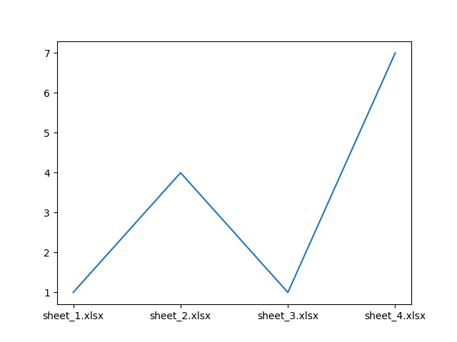

# pyGraph
This is a python script that graphs a singular cell across multiple excel files. This script can be run from the terminal, with information passed in as command line arguments. It can recursively scan a directory, looking for usable excel files.

This script utilizes Pandas, a popular data analysis and manipulation library for Python. 
Dependencies:
* matplotlib
* pandas
* openpyxl (If using xlGraph.py, an alternative that makes use of openpxyl instead of Pandas)

## Usage
This script is run using command-line arguments. Users enter the cell number that they want to capture, the desired name of the output image, and then the file paths to any number of excel files or directories.

```pandasGraph.py <cell_number> <image_name> <files> <directories> ....```  
##
# Example
```pandasGraph A2 GraphImage ./jSheets```


